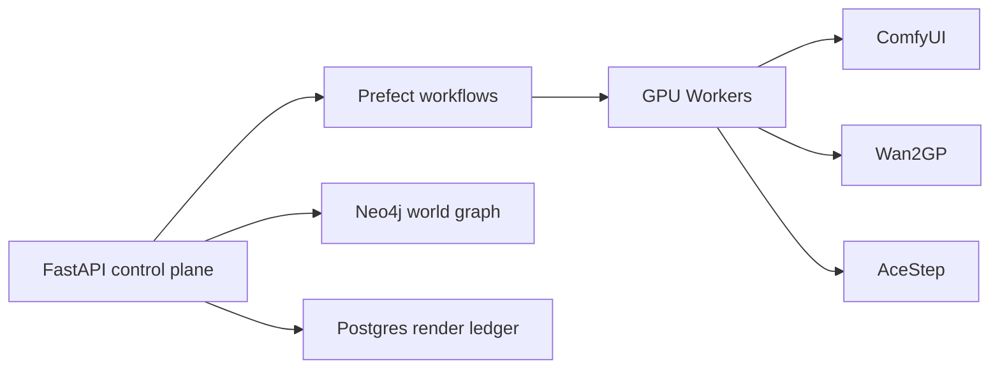

# Microdrama Orchestrator

Orchestration layer for AI-generated short-form video. Manages the full pipeline: planning, keyframe generation, video rendering, and Neo4j world-state ingestion -- across multiple GPU workers with lease-based mutual exclusion.

## License

[MIT](LICENSE)

## What It Does

Takes a scene description and runs the full production pipeline:

1. **Plan** -- Qwen 27B generates shot/audio/asset plans via LangGraph
2. **Keyframe** -- ComfyUI generates start/end keyframes with Z-Image/Klein
3. **Render** -- Wan2GP produces LTX 2.3 video with audio
4. **Ingest** -- Results go into Neo4j as `RenderRun` + `Asset` nodes linked to the world graph

All of this runs as Prefect flows with GPU leases, retry logic, and a Postgres-backed render ledger.

## Architecture



| Service | Purpose |
|---------|---------|
| `orchestrator-api` | REST control plane, health checks, GPU lease API |
| `prefect-server` | Durable workflow engine with retry, logging, scheduling |
| `prefect-worker` | Executes Python flows against local/remote GPU workers |
| `ltx-av-queue` | ComfyUI artifact queue for two-stage latent decode |
| `atlas-mcp` | Project/task management for agents (MCP protocol) |
| `postgres` | Prefect metadata and render run ledger |

## Key Features

### GPU Lease Management

Prevents two workflows from using the same GPU simultaneously:

```bash
curl -X POST http://127.0.0.1:8090/gpu/leases/acquire \
  -H 'Content-Type: application/json' \
  -d '{"job_id":"render-001","role":"wan2gp_ltx_30s","ttl_minutes":120}'
```

Leases auto-expire. Workers check lease ownership before starting renders.

### ComfyUI Artifact Queue

Splits Comfy workflows at expensive boundaries so different GPU workers can handle different stages. Stage 1 writes a `.READY` marker; stage 2 workers claim it, patch a workflow, and submit.

```bash
docker compose run --rm ltx-av-queue python -m app.artifact_queue_worker \
  --config /app/config/artifact_queue.example.json --status
```

The queue framework is generic -- any Comfy workflow can be split this way. See [`config/artifact_queue.example.json`](config/artifact_queue.example.json).

### Render Ledger

Every render attempt is tracked in Postgres with status, GPU IDs, manifest path, service checks, and errors. Query it:

```bash
curl http://127.0.0.1:8090/render-runs | jq .
```

## Quick Start

```bash
cp -n .env.example .env
# Edit .env to set your host-side volume paths
docker compose up -d --build
```

### Smoke Test

```bash
curl http://127.0.0.1:8090/health
curl http://127.0.0.1:8090/services
```

### Run a Dry-Render Flow

```bash
docker compose run --rm prefect-worker python -m flows.production_render_flow
```

This validates service reachability and writes a dry-run render manifest without submitting a GPU job.

## Configuration

Key environment variables:

| Variable | Default | Description |
|----------|---------|-------------|
| `QWEN27B_BASE_URL` | `http://localhost:8000/v1` | Planner LLM endpoint |
| `NEO4J_URI` | `bolt://neo4j-world:7687` | World graph database |
| `HOST_MICRODRAMA_PROJECTS` | `./data/projects` | Host path to project assets |
| `HOST_COMFY_OUTPUT` | `./data/comfy-output` | Host path to ComfyUI output |

See [`.env.example`](.env.example) for the full list.

## Worker Profiles

The cluster inventory lives in [`config/worker_profiles.json`](config/worker_profiles.json). Each profile describes:

- GPU count, architecture, and VRAM per card
- Available models and allowed job roles
- Throughput estimates per job type
- Service endpoints (Wan2GP, ComfyUI, vLLM)

Query available workers:

```bash
curl 'http://127.0.0.1:8090/workers?job_role=wan2gp_ltx_30s' | jq .
```

## Companion Projects

- [neo4j-world](https://github.com/jajmangold/neo4j-world) -- narrative world graph database
- [gv100-fecs-limiter](https://github.com/jajmangold/gv100-fecs-limiter) -- GPU firmware research (runs on the same CMP 100-210 hardware)
