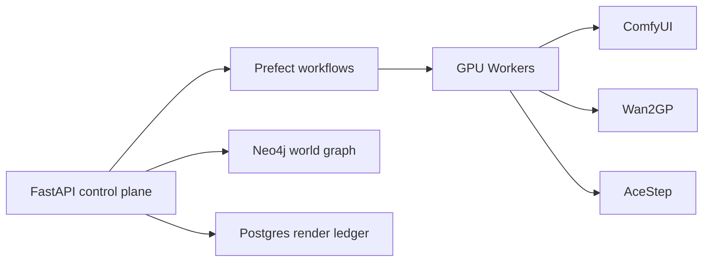

# Microdrama Orchestrator

[](./LICENSE)
[](https://hub.docker.com/)
[](https://www.python.org/)
[](https://fastapi.tiangolo.com/)

Orchestration layer for AI-generated short-form video. **From script to rendered video in one command** -- planning, keyframe generation, video rendering, and Neo4j world-state ingestion across multiple GPU workers with lease-based mutual exclusion.

---

## The Pipeline



| Stage | Tool | What Happens |
|-------|------|-------------|
| **Plan** | Qwen 27B + LangGraph | Generates shot/audio/asset plans |
| **Keyframe** | ComfyUI + Z-Image/Klein | Start/end keyframe generation |
| **Render** | Wan2GP + LTX 2.3 | Video with audio rendering |
| **Ingest** | Neo4j | Results linked to world graph |

All stages run as Prefect flows with GPU leases, retry logic, and a Postgres-backed render ledger.

## Services

| Service | Purpose |
|---------|---------|
| `orchestrator-api` | REST control plane, health checks, GPU lease API |
| `prefect-server` | Durable workflow engine with retry, logging, scheduling |
| `prefect-worker` | Executes Python flows against local/remote GPU workers |
| `ltx-av-queue` | ComfyUI artifact queue for two-stage latent decode |
| `atlas-mcp` | Project/task management for agents (MCP protocol) |
| `postgres` | Prefect metadata and render run ledger |

## Quick Start

```bash
cp -n .env.example .env
docker compose up -d --build
```

### Smoke Test

```bash
curl http://127.0.0.1:8090/health
curl http://127.0.0.1:8090/services
```

### Run a Dry-Render Flow

```bash
docker compose run --rm prefect-worker python -m flows.production_render_flow
```

Validates service reachability and writes a dry-run render manifest without submitting a GPU job.

## Features

| Capability | Description |
|-----------|-------------|
| GPU lease management | Prevents two workflows from using the same GPU simultaneously |
| ComfyUI artifact queue | Splits workflows at expensive boundaries for multi-GPU stages |
| Render ledger | Every render attempt tracked in Postgres with full audit trail |
| Worker profiles | Cluster inventory with GPU counts, models, and throughput estimates |
| Prefect workflows | Durable execution with retry, logging, and scheduling |
| REST control plane | Health checks, lease API, render run queries |

### GPU Leases

```bash
curl -X POST http://127.0.0.1:8090/gpu/leases/acquire \
  -H 'Content-Type: application/json' \
  -d '{"job_id":"render-001","role":"wan2gp_ltx_30s","ttl_minutes":120}'
```

Leases auto-expire. Workers check lease ownership before starting renders.

### Worker Profiles

Query available workers:

```bash
curl 'http://127.0.0.1:8090/workers?job_role=wan2gp_ltx_30s' | jq .
```

Cluster inventory in [`config/worker_profiles.json`](config/worker_profiles.json) -- GPU count, architecture, VRAM, allowed job roles, throughput estimates, and service endpoints.

## Configuration

| Variable | Default | Description |
|----------|---------|-------------|
| `QWEN27B_BASE_URL` | `http://localhost:8000/v1` | Planner LLM endpoint |
| `NEO4J_URI` | `bolt://neo4j-world:7687` | World graph database |
| `HOST_MICRODRAMA_PROJECTS` | `./data/projects` | Host path to project assets |
| `HOST_COMFY_OUTPUT` | `./data/comfy-output` | Host path to ComfyUI output |

See [`.env.example`](.env.example) for the full list.

## Companion Projects

| Project | Purpose |
|---------|---------|
| [neo4j-world](https://github.com/jajmangold/neo4j-world) | Narrative world graph database |
| [gv100-fecs-limiter](https://github.com/jajmangold/gv100-fecs-limiter) | GPU firmware research (runs on the same CMP 100-210 hardware) |

## Contributing

Issues and PRs welcome. See the [CLAUDE.md](CLAUDE.md) for architecture conventions.

## License

[MIT](LICENSE)
